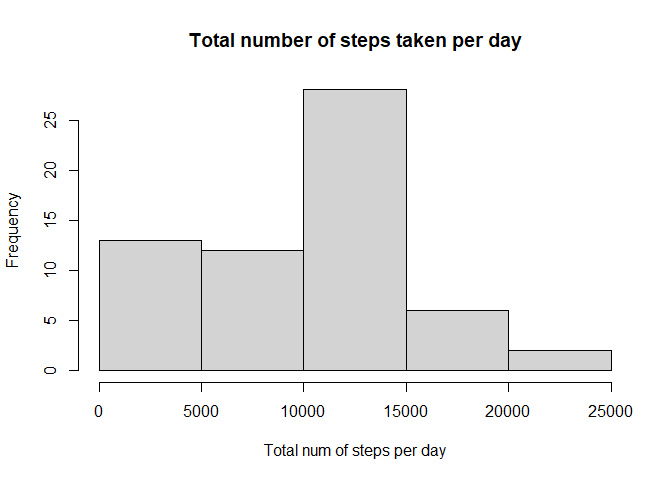
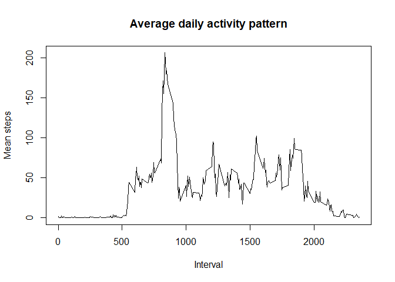

## Loading and preprocessing the data


``` r
unzip("activity.zip")
data<-read.csv("activity.csv")
data$date<-as.Date(data$date,format = "%Y-%m-%d")
```

## What is mean total number of steps taken per day?
#Calculate the total number of steps taken per day

``` r
library(dplyr)
```

```
## 
## Attaching package: 'dplyr'
```

```
## The following objects are masked from 'package:stats':
## 
##     filter, lag
```

```
## The following objects are masked from 'package:base':
## 
##     intersect, setdiff, setequal, union
```

``` r
mean_step<- summarize(group_by(data,date),total = sum(steps,na.rm= TRUE))
```

#If you do not understand the difference between a histogram and a barplot, research the difference between them. Make a histogram of the total number of steps taken each day

``` r
hist(mean_step$total,main = "Total number of steps taken per day",xlab = "Total num of steps per day")
```

<!-- -->

#Calculate and report the mean and median of the total number of steps taken per day

``` r
mean(mean_step$total)
```

```
## [1] 9354.23
```

``` r
median(mean_step$total)
```

```
## [1] 10395
```
Mean is 9354.23
Median is 10395

## What is the average daily activity pattern?

#Make a time series plot (i.e.type = "l") of the 5-minute interval (x-axis) and the average number of steps taken, averaged across all days (y-axis)


``` r
mean_step_interval<- summarize(group_by(data,interval),mean = mean(steps,na.rm= TRUE))
plot(mean_step_interval$interval,mean_step_interval$mean,type = "l"
     ,xlab = "Interval",ylab = "Mean steps",main = "Average daily activity pattern")
```

<!-- -->

#Which 5-minute interval, on average across all the days in the dataset, contains the maximum number of steps?


``` r
mean_step_interval[which.max(mean_step_interval$mean),1]
```

```
## # A tibble: 1 × 1
##   interval
##      <int>
## 1      835
```

Interval 835 has max mean number of steps.

## Imputing missing values
#Calculate and report the total number of missing values in the dataset 

``` r
sum(is.na(data$steps))
```

```
## [1] 2304
```
The total number of missing values is 2304.

#Devise a strategy for filling in all of the missing values in the dataset. The strategy does not need to be sophisticated. For example, you could use the mean/median for that day, or the mean for that 5-minute interval, etc.
Fill NA with the mean for that 5-minute interval

``` r
data$steps_filled<-ifelse(is.na(data$steps),round(mean_step_interval$mean[match(data$interval, mean_step_interval$interval)],digits = 0),data$steps)
head(data)
```

```
##   steps       date interval steps_filled
## 1    NA 2012-10-01        0            2
## 2    NA 2012-10-01        5            0
## 3    NA 2012-10-01       10            0
## 4    NA 2012-10-01       15            0
## 5    NA 2012-10-01       20            0
## 6    NA 2012-10-01       25            2
```
#Create a new dataset that is equal to the original dataset but with the missing data filled in.

``` r
data_filled <- data.frame(cbind(data$steps_filled,data$date,data$interval))
colnames(data_filled)<- c("steps","date","interval")
data_filled$date<-as.Date(data_filled$date,format = "%Y-%m-%d")
```

#Make a histogram of the total number of steps taken each day and Calculate and report the mean and median total number of steps taken per day. Do these values differ from the estimates from the first part of the assignment? What is the impact of imputing missing data on the estimates of the total daily number of steps?

``` r
dt_sum<-summarise(group_by(data_filled,date),sum = sum(steps))
hist(dt_sum$sum,xlab = "Total steps per day",main = "the total number of steps taken each day")
```

<!-- -->


``` r
mean(dt_sum$sum)
```

```
## [1] 10765.64
```

``` r
median(dt_sum$sum)
```

```
## [1] 10762
```

``` r
mean(dt_sum$sum)-mean(mean_step$total)
```

```
## [1] 1411.41
```

``` r
median(dt_sum$sum)-median(mean_step$total)
```

```
## [1] 367
```

Mean is 10765.64, difference with before is 1411.41
Median is 10762,, difference with before is 367


## Are there differences in activity patterns between weekdays and weekends?
#Create a new factor variable in the dataset with two levels – “weekday” and “weekend” indicating whether a given date is a weekday or weekend day.


``` r
data_filled$weekday<-ifelse(weekdays(data_filled$date)=="Saturday"|weekdays(data_filled$date)=="Sunday","weekend","weekday")
```

#Make a panel plot containing a time series plot (i.e.type = "l") of the 5-minute interval (x-axis) and the average number of steps taken, averaged across all weekday days or weekend days (y-axis). See the README file in the GitHub repository to see an example of what this plot should look like using simulated data.

``` r
weekday_mean<-summarise(group_by(data_filled,interval,weekday),avg = mean(steps))
```

```
## `summarise()` has grouped output by 'interval'. You can override using the
## `.groups` argument.
```

``` r
library(ggplot2)
ggplot(weekday_mean,aes(interval,avg))+
  geom_line()+ facet_grid(weekday ~ .) + 
  xlab("Interval") + ylab("Mean steps") +
  theme_light()
```

<!-- -->


